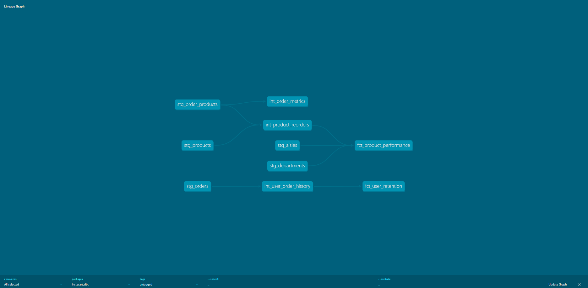
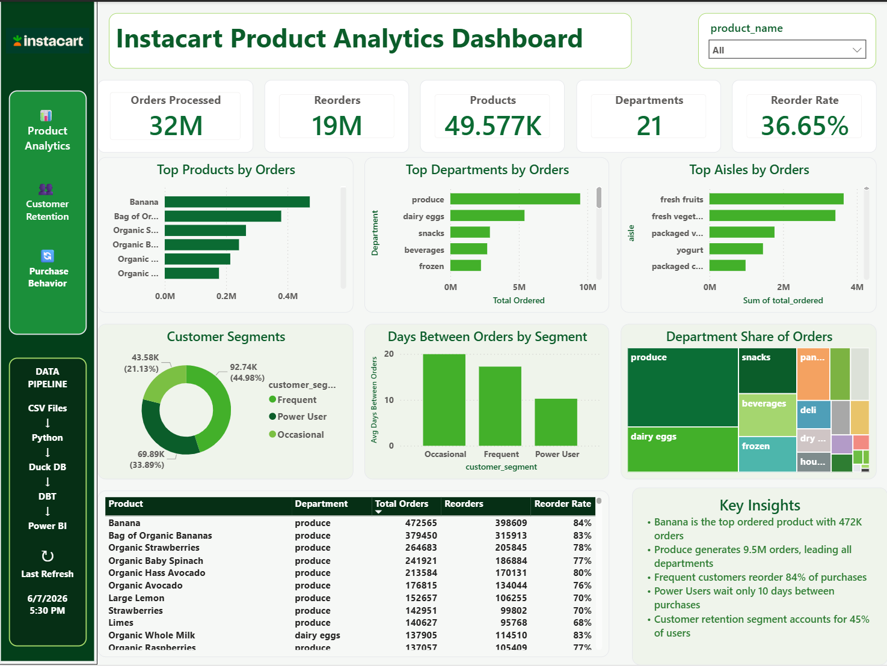

# Instacart Product Analytics Platform

End-to-end Analytics Engineering project built using real Instacart customer order data from Kaggle.

## Overview

This project simulates an Analytics Engineering workflow used by companies such as Instacart, DoorDash, Uber Eats, Walmart, and Amazon.

The pipeline ingests raw customer order data, loads it into DuckDB, transforms it using dbt, and prepares analytics-ready data models for reporting in Power BI.

---

## Tech Stack

- Python
- DuckDB
- dbt
- Power BI
- Git
- GitHub

---

## Dataset

Source:

Instacart Market Basket Analysis Dataset

Dataset Size:

- 3.4 Million Orders
- 32.4 Million Order-Product Records
- 49,688 Products
- 134 Aisles
- 21 Departments

---

## Business Questions

This project answers several common e-commerce and grocery analytics questions:

### Product Analytics

- Which products are purchased most frequently?
- Which products have the highest reorder rates?
- Which departments drive the most customer loyalty?
- Which aisles generate the highest volume of purchases?

### Customer Analytics

- How many products does the average customer purchase?
- How many unique products are purchased per order?
- How often do customers reorder products?
- What customer retention patterns exist?

---

## Architecture

```text
Raw CSV Files
      │
      ▼
Python Ingestion
      │
      ▼
DuckDB Warehouse
      │
      ▼
dbt Staging Models
      │
      ▼
dbt Intermediate Models
      │
      ▼
dbt Mart Models
      │
      ▼
Power BI Dashboard
```

---

## Project Structure

```text
instacart-product-analytics-platform/

│
├── data/
│   ├── raw/
│   └── processed/
│
├── src/
│   └── data/
│       └── load_to_duckdb.py
│
├── instacart_dbt/
│   ├── models/
│   │   ├── staging/
│   │   ├── intermediate/
│   │   └── marts/
│   │
│   ├── tests/
│   ├── macros/
│   └── snapshots/
│
├── docs/
│
└── README.md
```

---

## Data Models

### Staging Layer

- stg_orders
- stg_order_products
- stg_products
- stg_aisles
- stg_departments

Purpose:

- Standardize raw source data
- Prepare clean analytical datasets

---

### Intermediate Layer

#### int_order_metrics

Order-level metrics including:

- Total Items
- Unique Products
- Reordered Items
- Average Cart Position

#### int_product_reorders

Product-level reorder analysis including:

- Total Orders
- Total Reorders
- Reorder Rate

#### int_user_order_history

Customer ordering behavior including:

- Order Frequency
- Purchase History
- Retention Metrics

---

### Mart Layer

#### fct_product_performance

Business-ready product performance table containing:

- Product Popularity
- Product Reorder Rate
- Department Metrics
- Aisle Metrics

#### fct_user_retention

Customer retention fact table containing:

- Total Orders
- Average Days Between Orders
- Customer Activity Metrics

---

## dbt Lineage

The project uses dbt to build a layered analytics architecture:

```text
Staging
   ↓
Intermediate
   ↓
Mart
```



---

## Power BI Dashboard

Dashboard includes:

### Executive Overview

- Total Orders
- Total Products
- Reorder Rate
- Average Products Per Order

### Product Analytics

- Top Products
- Top Departments
- Product Reorder Analysis

### Customer Retention

- Customer Purchase Behavior
- Repeat Purchase Trends
- Retention Metrics



---

## Key Outcomes

- Built analytics-ready data warehouse using DuckDB
- Modeled 32M+ order-product records
- Created layered dbt transformation architecture
- Produced business-ready fact tables
- Enabled downstream Power BI reporting

---

## Future Enhancements

- Incremental dbt Models
- Automated dbt Tests
- GitHub Actions CI/CD
- Data Quality Monitoring
- Cloud Data Warehouse Deployment
- Orchestration with Airflow

---

## Author

Sam Sahami

Analytics Engineering Portfolio Project